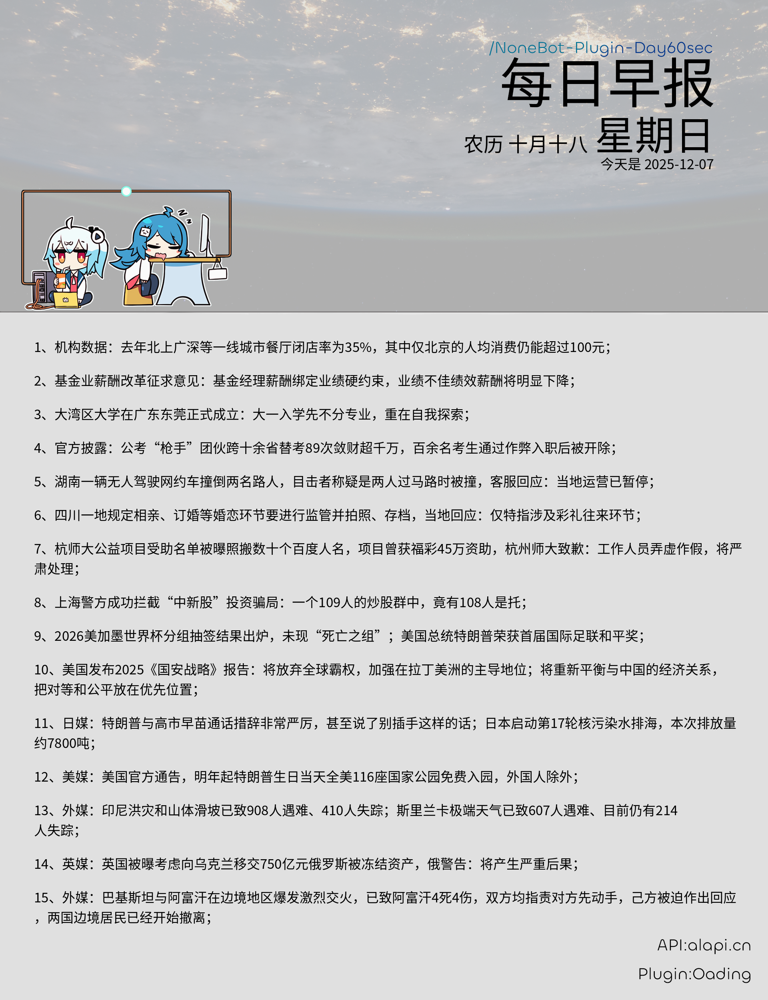

<div align="center">
  
# NoneBot-Plugin-Day60sec


</div>

<div align="center">

---



</div>

---

## 项目结构

```
NoneBot-Plugin-Day60sec/
├── archive/
│   ├── image/
│   └── json/
│       └── api-return-example.json
├── assets/
│   ├── background.png 
│   ├── example.png
│   └── fonts/
│       ├── Chillax-Regular.otf
│       └── SourceHanSansCN-Regular.otf
├── merge.py                              # json处理为img
├── plugin.py                             # 响应指令 每日定时推送 
├── request.py                            # 向api请求数据 存入archive/json内 格式: %Y-%m-%d.json
├── config.yaml                           # 填写token(querystring:token)与需要推送的群组(daily_report_groups)
├── .gitignore
├── LICENSE
├── README.md
└── requirements.txt
```

---

## 功能

> [!NOTE]
> **手动请求 & 自动推送 (7:30AM)**

**<p>手动请求指令：</p>**
<table>
  <tr>
    <td>!reqday60s</td>
    <td>！reqday60s</td>
    <td>每日早报</td>
  </tr>
</table>

---

## 部署注意事项

**<p>api申请:alapi.cn->每日早报</p>**
**<p>api token:config.yaml->querystring:token</p>**
**<p>需要推送的群列表:config.yaml->daily_report_groups</p>**
**<p>依赖:requirements.txt</p>**
